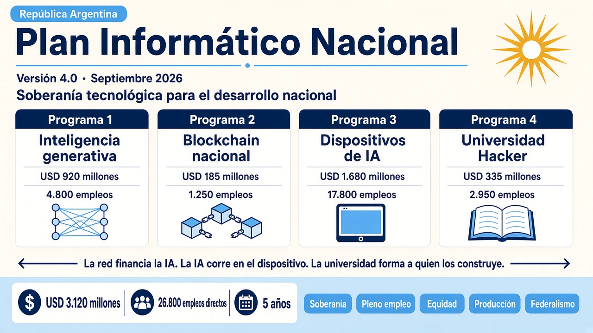
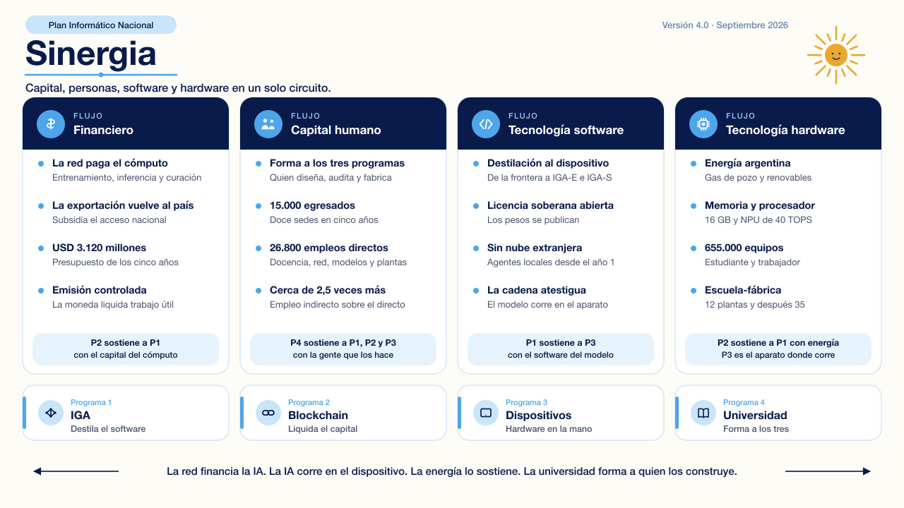
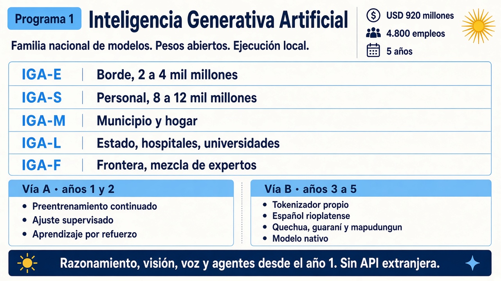
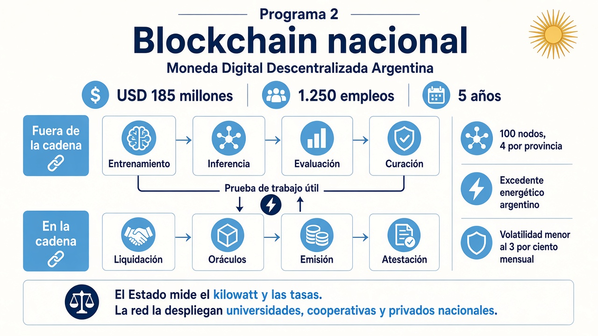
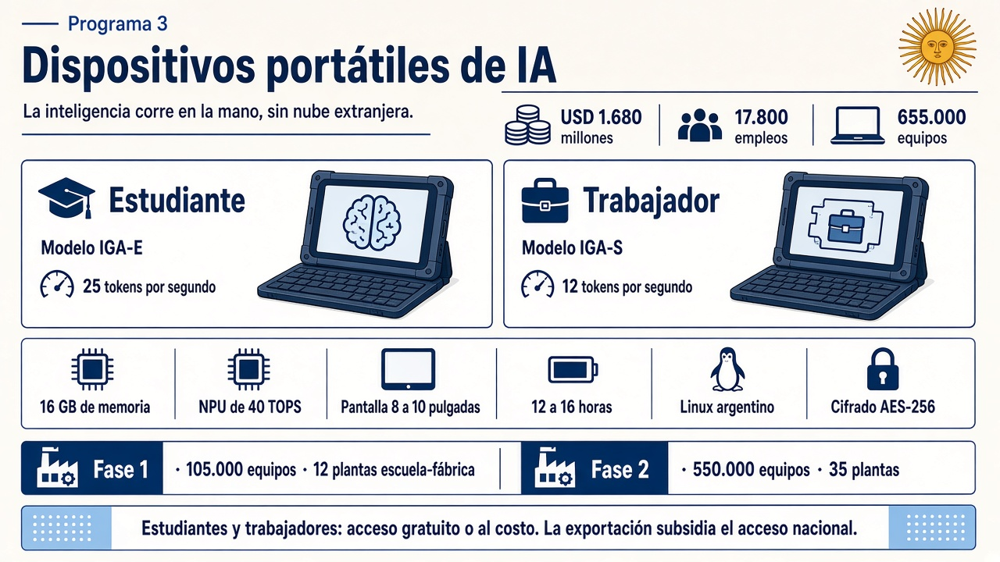
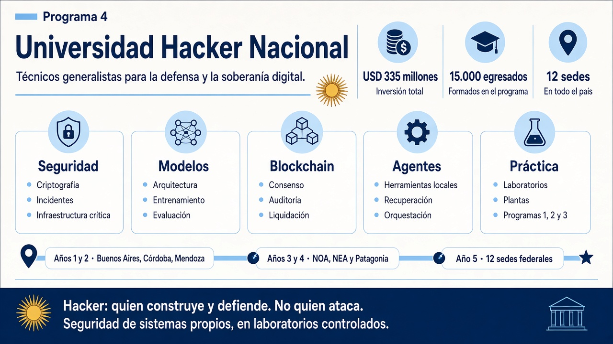

# Plan Informático Nacional

_LICENCIA: Los textos del Plan están en CC0 1.0 (dominio público). No se pide atribución del autor original._

Estrategia de soberanía tecnológica de la República Argentina. Versión 4.0, septiembre de 2026. Cuatro programas, cinco años, **USD 3.120 millones** y **26.800 empleos directos**. El empleo indirecto multiplica esa cifra por cerca de 2,5.

El Plan no persigue un modelo denso de 200 mil millones de parámetros para igualar un comunicado extranjero. Persigue modelos que corran en manos argentinas, con corpus argentino, energía argentina y profesionales argentinos.

## Cómo se articulan

La red del Programa 2 liquida, en cadena, el trabajo útil que entrena y evalúa la familia IGA. Esos modelos se destilan y corren, sin nube extranjera, en los dispositivos del Programa 3. La Universidad Hacker Nacional forma a quien diseña, audita y fabrica los tres. El excedente energético de P2 sostiene el cómputo de P1. P3 es el aparato donde corre.

| Programa | Inversión | Empleo directo | Plazo |
| --- | ---: | ---: | ---: |
| 1. Inteligencia Generativa Artificial | USD 920 millones | 4.800 | 5 años |
| 2. Blockchain nacional | USD 185 millones | 1.250 | 5 años |
| 3. Dispositivos portátiles de IA | USD 1.680 millones | 17.800 | 5 años |
| 4. Universidad Hacker Nacional | USD 335 millones | 2.950 | 5 años |
| **Total** | **USD 3.120 millones** | **26.800** | **5 años** |

Cinco principios ordenan el conjunto: soberanía tecnológica, pleno empleo, equidad, desarrollo productivo e integración federal.

## Programa 1. Inteligencia Generativa Artificial

Familia nacional de modelos de texto, visión, voz y agentes, con español rioplatense y lenguas originarias (quechua, guaraní y mapudungun). Los pesos se publican con licencia soberana abierta. La ejecución es local.

- **IGA-E** corre en el borde; **IGA-S**, en el dispositivo del trabajador; **IGA-M**, en el municipio; **IGA-L**, en hospitales y universidades; **IGA-F** es la frontera, una mezcla de expertos y no un denso de 200 mil millones.
- **Vía A (años 1 y 2):** preentrenamiento continuado, ajuste supervisado y aprendizaje por refuerzo sobre bases permisivas.
- **Vía B (años 3 a 5):** tokenizador propio y arquitectura nativa, destilada hacia los dispositivos.

Detalle: [programa en Markdown](PLAN_INFORMATICO_DETALLE_MARKDOWN/01_P1_IGA_Detallado.md).

## Programa 2. Blockchain nacional

Moneda Digital Descentralizada Argentina. El trabajo útil —entrenamiento, inferencia, evaluación y curación— ocurre fuera de la cadena. La cadena liquida, atestigua y emite. El excedente energético argentino (gas de pozo y renovables) alimenta ese cómputo.

- Meta de red: 100 nodos, al menos 4 por provincia.
- El Estado mide el kilowatt y fija tasas de referencia. Universidades, cooperativas y privados nacionales despliegan la red.
- Volatilidad objetivo: menor al 3 % mensual.

Detalle: [programa en Markdown](PLAN_INFORMATICO_DETALLE_MARKDOWN/02_P2_Blockchain_Detallado.md).

## Programa 3. Dispositivos portátiles de IA

Dos equipos nacionales, estudiante y trabajador, con la inteligencia en el aparato. Sin cuenta obligatoria, sin telemetría y sin nube extranjera. Se arman en plantas escuela-fábrica.

- 16 GB de memoria, NPU de al menos 40 TOPS, pantalla de 8 a 10 pulgadas, 12 a 16 horas de autonomía.
- IGA-E a 25 tokens por segundo en el equipo de estudiante; IGA-S a 12 tokens por segundo en el de trabajador.
- 655.000 equipos en cinco años: 105.000 en la fase 1 (12 plantas) y 550.000 en la fase 2 (35 plantas).
- Estudiantes y trabajadores argentinos: acceso gratuito, al costo o con subsidio. La exportación a precio completo financia ese acceso.

Detalle: [programa en Markdown](PLAN_INFORMATICO_DETALLE_MARKDOWN/03_P3_Dispositivos_Detallado.md).

## Programa 4. Universidad Hacker Nacional

Red federal de formación superior. Acá «hacker» nombra al técnico generalista que construye y defiende. No al que ataca. La seguridad se enseña sobre sistemas propios, en laboratorios controlados. Este repositorio no publica procedimientos de ataque.

- Ejes: seguridad, modelos, blockchain, agentes y práctica con los otros tres programas.
- 15.000 egresados y 12 sedes. Años 1 y 2: Buenos Aires, Córdoba y Mendoza. Después, NOA, NEA y Patagonia.
- USD 335 millones, con 2.950 puestos directos entre docencia, investigación y personal.

Detalle: [programa en Markdown](PLAN_INFORMATICO_DETALLE_MARKDOWN/04_P4_Universidad_Hacker_Nacional_Detallado.md).

## Documentos

| Carpeta | Contenido |
| --- | --- |
| [PLAN_INFORMATICO_DETALLE_MARKDOWN](PLAN_INFORMATICO_DETALLE_MARKDOWN/00_PLAN_INFORMATICO_NACIONAL.md) | Texto fuente, versión 4.0 |
| [DOCs](DOCs) | Misma pieza en Word |
| [PDFs](PDFs) | Misma pieza en PDF |
| [infografias](infografias) | Láminas de este README |
| [_build](_build) | Script que pasa el Markdown a Word (`npm install` dentro de `_build`) |

El documento central está en [00_PLAN_INFORMATICO_NACIONAL.md](PLAN_INFORMATICO_DETALLE_MARKDOWN/00_PLAN_INFORMATICO_NACIONAL.md).

## Licencia

Los textos del Plan están en [CC0 1.0](https://creativecommons.org/publicdomain/zero/1.0/deed.es) (dominio público). No se pide atribución del autor original.
